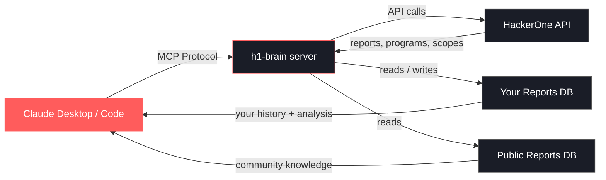
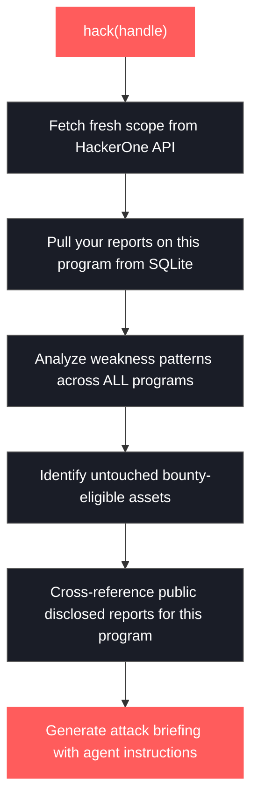

--[ repository ]------------------------------------------------------------

    URL      : https://github.com/imattas/HackerOne-Brain
    Language : Python
    Status   : active
    Stars    : 0
    Updated  : 2026-06-26

Multi-agent HackerOne MCP server with Codex installer

---

# h1-brain

An MCP server that connects your AI assistant to HackerOne. It pulls your bug bounty history, program scopes, and report details into a local SQLite database, then exposes tools that let any MCP-compatible client (Claude Desktop, Claude Code, etc.) search, analyze, and build on your past work.

It also ships with a **pre-built database of 3,600+ publicly disclosed bounty-awarded reports** from the HackerOne community — full vulnerability write-ups, weakness types, and bounty amounts. The AI uses both your personal data and public knowledge to generate attack briefings.

The primary tool, `hack(handle)`, generates a full hacking session briefing in a single call: fresh scope from the API, your past findings, public disclosures for that program, weakness patterns, untouched assets, and suggested attack vectors — all formatted as actionable instructions that put the AI in offensive mode.


## How It Works

For a full walkthrough, check out the three-part **[Bug Bounty Goldfish](https://clawd.it/series/bug-bounty-goldfish/)** series:

1. **[Teaching Claude Everything You've Hacked](https://clawd.it/posts/11-teaching-claude-everything-youve-hacked/)** — Why I built h1-brain and how to set it up
2. **[What h1-brain Actually Does](https://clawd.it/posts/12-what-h1-brain-actually-does/)** — Every tool explained, from search to the `hack()` briefing
3. **[Running h1-brain Against a Real Target](https://clawd.it/posts/13-running-h1-brain-against-a-real-target/)** — A start-to-finish walkthrough on an actual program





## Requirements

- Python 3.10+
- A HackerOne API token ([generate one here](https://hackerone.com/settings/api_token/edit))

## Setup

Install and register with Codex from GitHub:

```bash
curl -fsSL https://raw.githubusercontent.com/imattas/HackerOne-Brain/main/install.sh | bash
```

Install with HackerOne credentials already configured for the MCP server:

```bash
curl -fsSL https://raw.githubusercontent.com/imattas/HackerOne-Brain/main/install.sh \
  | H1_USERNAME=your_hackerone_username H1_API_TOKEN=your_api_token bash
```

Other install options:

```bash
curl -fsSL https://raw.githubusercontent.com/imattas/HackerOne-Brain/main/install.sh | AGENT=claude bash
curl -fsSL https://raw.githubusercontent.com/imattas/HackerOne-Brain/main/install.sh | AGENT=none H1_BRAIN_INSTALL_DIR="$HOME/tools/h1-brain" bash
```

Manual install:

```bash
git clone https://github.com/imattas/HackerOne-Brain.git
cd HackerOne-Brain
python -m venv venv
source venv/bin/activate
pip install -r requirements.txt
```

The public disclosed reports database (`disclosed_reports.db`) is downloaded by
the installer. It is not committed to this mirror because disclosed reports can
contain historical secret-looking strings that GitHub push protection blocks.
For manual installs, run `./scripts/fetch-disclosed-db.sh`.

For a Codex local install from this checkout:

```bash
./scripts/install-agent.sh codex
```

## Agent Compatibility

h1-brain is a stdio MCP server and works with any local MCP-compatible agent
that can launch a command, including Codex, Claude Code, Claude Desktop, Cursor,
Windsurf, Cline, and similar clients.

The server starts even when HackerOne credentials are not configured, which lets
agents enumerate tools during startup. Tools that call the HackerOne API return
a setup message until `H1_USERNAME` and `H1_API_TOKEN` are available. Public
disclosed-report search does not need HackerOne credentials.

If your clone did not hydrate the Git LFS database, fetch it directly:

```bash
./scripts/fetch-disclosed-db.sh
```

See [docs/multi-agent-setup.md](https://github.com/imattas/HackerOne-Brain/blob/main/docs/multi-agent-setup.md) for agent-specific
configuration examples.

## Connecting to Agents

### Codex

```bash
codex mcp add h1-brain \
  --env H1_USERNAME=your_hackerone_username \
  --env H1_API_TOKEN=your_api_token \
  -- /path/to/h1-brain/venv/bin/python /path/to/h1-brain/server.py
```

Or without credentials, so Codex can start and expose public-report tools:

```bash
codex mcp add h1-brain -- /path/to/h1-brain/venv/bin/python /path/to/h1-brain/server.py
```

### Claude Desktop

Add to `~/Library/Application Support/Claude/claude_desktop_config.json`:

```json
{
  "mcpServers": {
    "h1-brain": {
      "command": "/path/to/h1-brain/venv/bin/python",
      "args": ["/path/to/h1-brain/server.py"],
      "env": {
        "H1_USERNAME": "your_hackerone_username",
        "H1_API_TOKEN": "your_api_token"
      }
    }
  }
}
```

Restart Claude Desktop after saving.

### Claude Code

```bash
claude mcp add h1-brain \
  -e H1_USERNAME=your_hackerone_username \
  -e H1_API_TOKEN=your_api_token \
  -- /path/to/h1-brain/venv/bin/python /path/to/h1-brain/server.py
```

## First Run

After connecting, populate your personal database:

1. **`fetch_rewarded_reports`** — Pulls all your bounty-awarded reports with full vulnerability write-ups. This is the most important step.
2. **`fetch_programs`** — Pulls all programs you have access to.

These only need to be run once. Re-run periodically to sync new reports.

The public disclosed reports are ready to query immediately — no setup needed.

## Tools

### `hack(handle)`

The primary entry point. One call does everything:

1. Fetches fresh program scopes from the HackerOne API
2. Pulls your past rewarded reports for that program
3. Cross-references your full report history for weakness patterns
4. Identifies untouched bounty-eligible assets
5. Pulls public disclosed reports for this program — what other researchers found and got paid for
6. Suggests attack vectors based on weaknesses that paid elsewhere but haven't been found here
7. Returns an attack briefing that puts the AI in offensive mode

**Briefing structure:**

- **Scope** — bounty-eligible and non-bounty assets with severity caps
- **Your Past Findings** — rewarded reports with severity, weakness type, and bounty amounts
- **Weakness Types That Worked** — what's been rewarded here before
- **Untouched Scope** — bounty-eligible assets with zero findings from you
- **Suggested Attack Vectors** — weaknesses rewarded on other programs but not yet found here
- **Public Disclosed Reports** — what other researchers found on this program, weakness patterns from public disclosures
- **Instructions** — puts the AI in attack mode with specific directives

### Your Reports

These query your personal data (`h1_data.db`). No API calls, instant results.

| Tool | Description |
|------|-------------|
| `search_reports(query, program, weakness, severity, limit)` | Search your rewarded reports by title, program, weakness type, or severity |
| `get_report(report_id)` | Full report details with vulnerability write-up and attachments |
| `get_report_summary()` | Reports grouped by program with totals |
| `search_programs(query, bounty_only, limit)` | Search your stored programs |
| `search_scopes(program, asset, bounty_only, limit)` | Search in-scope assets across programs |
| `fetch_attachment(report_id, attachment_id?)` | Fresh download URLs for report attachments (expire in ~1 hour) |

### Public Disclosed Reports

These query the pre-built database of 3,600+ bounty-awarded public disclosures (`disclosed_reports.db`).

| Tool | Description |
|------|-------------|
| `search_disclosed_reports(query, program, weakness, limit)` | Full-text search across public reports — titles and vulnerability write-ups |
| `get_disclosed_report(report_id)` | Full details of a public disclosed report |

### Data Sync

| Tool | Description |
|------|-------------|
| `fetch_rewarded_reports` | Sync your bounty-awarded reports from the API |
| `fetch_programs` | Sync your accessible programs |
| `fetch_program_scopes(handle)` | Sync scopes for a program (called automatically by `hack()`) |

## Architecture

```
server.py              MCP server
hack_instructions.md   Attack briefing instructions (loaded by hack())
h1_data.db             Your personal reports, programs, scopes (auto-created, gitignored)
disclosed_reports.db   3,600+ public disclosed bounty reports (ships with repo)
requirements.txt       Python dependencies (mcp, httpx)
```

### Two Databases

| Database | Contains | Source |
|----------|----------|--------|
| `h1_data.db` | Your personal reports, programs, scopes, attachments | HackerOne API (your account) |
| `disclosed_reports.db` | Public disclosed reports that paid a bounty | Pre-built, ships with repo |

The AI knows the difference. Your personal tools (`search_reports`, `get_report`) query your data. Public tools (`search_disclosed_reports`, `get_disclosed_report`) query community data. `hack()` uses both.

### Public Reports Database

The `disclosed_reports.db` contains publicly disclosed HackerOne reports that:
- Paid a bounty
- Have actual vulnerability write-ups (redacted/empty reports are excluded)

Each report includes: title, vulnerability details, weakness type, program, asset, CVEs, and bounty amount (when available).

## Author

**Patrik Grobshäuser** — [LinkedIn](https://www.linkedin.com/in/patrikfehrenbach/) · [X](https://x.com/itsecurityguard)

## License

MIT
